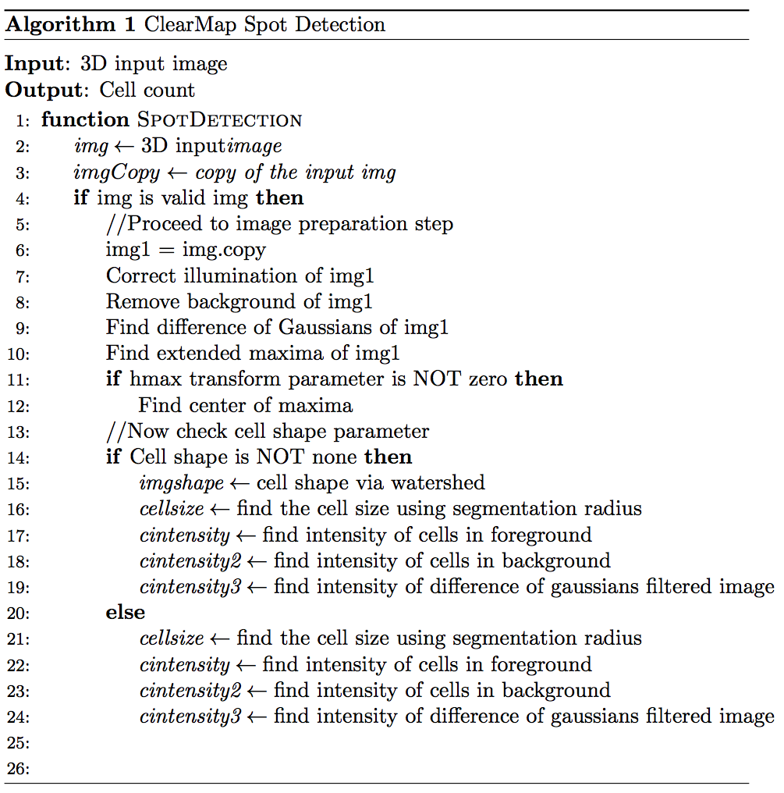

# setting

setting: given a stack of .tif files

loss: we evaluate performance via the 0-1 loss, $\delta: \mathcal{X} \times \mathcal{Y} \rightarrow {0,1}$, meaning, $\delta(x,y) := \mathbb{I}[g_n(x) \neq y]$ Specifically, an algorithm for cell detection is considered to be "superior" IF we can verify accuracy on existing brain data AND be able to compare the results with pre-annotated data from Ailey.

statistical task: learn a classifier that minimizes expected loss to calculate cell count

desiderata: we desire an approach that:

**works well in theory on certain settings**
    -[ ] Must be useful for Ailey's brains
    -[ ] Must work on resolution 5 images
    
**empirically performs well on simulations according to those settings AND is robust to those assumptions**
Simulations will include
    -[ ] Fear brain (Since cells much more visible)
    -[ ] High resolution brain data that is pre annotated and has a rough cell count
    
**empirically performs well on the real data is fast enough is easy to use approach**
    -[ ] Must take less than 10GB of hard drive space to set up
    -[ ] Must take less than 32GB of ram to utilize
    
# approach

paragraph explanation of approach: Simplistically - first a gaussian filter is used, followed by a peak detection step. This allows us to detect "spots" (image abnormalities) in the desired images.

# results

### why would it work well

For the Aut brains AND our purposes this would most likely not work well. In order for this algorithm to work efficiently, it requires a high level computational power and high resolution images. Additionally it also requires images which contain highly defined cell shapes. Our situation fails on all fronts.
